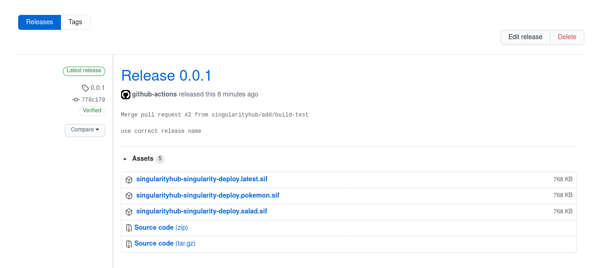

# Singularity Deploy


Wouldn't it be nice to build Singularity images without a registry proper,
and just keep them alongside the GitHub codebase? This is now possible!
This small repository provides an example to get you started. It will
build one or more images (whatever Singularity.* files that are present at
the root) and then release them as assets to your GitHub repository so
that they can be programatically obtained. It is associated with 
[singularity-hpc](https://github.com/singularityhub/singularity-hpc) to allow
you to then define LMOD modules for these same containers. 

> Can I upload the largest of chonkers?

Yes and no. Note that assets are limited to 2 GB in size, which is still fairly good. You can use
it as a template for your own recipes as is, or modify it for your custom
use case. Instructions are below!

**Note** Currently recipe extensions are associated with tags, and the GitHub release is
associated with a digest. We likely will change this in the next few weeks so that GitHub
releases are tags, and the "digests" are flie names. Stay tuned for updates!

## Getting Started

### 1. Template or Fork

If you haven't already, template or fork this repository. You can then clone
your fork:

```bash
$ git clone git@github.com:<username>/singularity-deploy
```

You likely want to name the repository by the container. For example, if I would
have created a container on Docker Hub or similar with the name `vsoch/salad`,
here I'd call the repository `salad`. You obviously are limited to your username
or an organizational namespace.

### 1. Write your Singularity Recipe(s)

First, you should write your container recipe(s) in the present working directory.
For good practice, when you are updating recipes you should checkout a new branch
and open a pull request, as the repository comes with a workflow to trigger on a PR
to [test your container build](.github/workflows/test.yml). Note that in the main workflow
that deploys the releases, the current branch is set to be `main-branch`. You should
update this to be your main "production" branch that you want to deploy releases on merge.
You are also free to choose a different trigger and release strategy. You can add any additional
tests that that you might need. By default, any Singularity.* file will be automatically detected. 
If there is no extension (the name Singularity), the name used will be "latest." 
You can use these tags across multiple releases of your containers. For example,
these files would generate packages with sifs named as follows:

 - [Singularity](Singularity) maps to [https://github.com/singularityhub/singularity-deploy/releases/download/0.0.1/singularityhub-singularity-deploy.latest.sif](https://github.com/singularityhub/singularity-deploy/releases/download/0.0.1/singularityhub-singularity-deploy.latest.sif)
 - [Singularity.pokemon](Singularity.pokemon) maps to [https://github.com/singularityhub/singularity-deploy/releases/download/0.0.1/singularityhub-singularity-deploy.pokemon.sif](https://github.com/singularityhub/singularity-deploy/releases/download/0.0.1/singularityhub-singularity-deploy.pokemon.sif)
 - [Singularity.salad](Singularity.salad) maps to [https://github.com/singularityhub/singularity-deploy/releases/download/0.0.1/singularityhub-singularity-deploy.salad.sif](https://github.com/singularityhub/singularity-deploy/releases/download/0.0.1/singularityhub-singularity-deploy.salad.sif)

For each name, you can see the direct download URL contains the repository (singularityhub/singularity-deploy),
You should not use any `:` characters in either your container tag (the GitHub extension) or
the GitHub tags (the release tags) as this might interfere with parsing.
The GitHub release tag (0.0.1 in the example above) is discussed next.

### 2. Update the VERSION file

Any time that you prepare new container recipes, you should update the [VERSION](VERSION)
file. The way that this repository works is to generate a release based on the
string in `VERSION`. A version is just a tag, so it could be something like
`0.0.1` or `0.0.1-slim`. Keep in mind that GitHub releases cannot have duplicated
names, so you should not repeat the same tag. Do not use `:` in your tag names.
If you do need to re-release a tag (not recommended if a user might be using it and then it's changed) you can manually delete
the release and the tag in the GitHub interface. This is a nice structure because it
means you can have containers with different names under the same tag. In the example
above, we have each of "pokemon," "latest," and "salad" released under tag 0.0.1.
This is how it looks on GitHub:



### 3. How to Develop

As we mentioned previously, the container builds will be tested on a pull request,
and the release will trigger on merge into your main branch (main). See the [.github/workflows/builder.yml](.github/workflows/builder.yml))
to edit this. The idea is that you can:

1. Develop your container via a development branch
2. Open a pull request to test the container (the [.github/workflows/test.yml](.github/workflows/test.yml))
3. On merge, your container will be released!

### 4. How to pull

Technically, Singularity can pull just knowing the URL. For example:

```bash
$ singularity pull https://github.com/singularityhub/singularity-deploy/releases/download/0.0.1/singularityhub-singularity-deploy.latest.sif
```

However, the [singularity-hpc](singularity-hpc) tool (will be) designed to be able to parse and handle
these container uris automatically. For the containers here, you could do:

```bash
$ shpc pull gh://singularityhub/singularity-deploy/0.0.1:latest
$ shpc pull gh://singularityhub/singularity-deploy/0.0.1:salad
$ shpc pull gh://singularityhub/singularity-deploy/0.0.1:pokemon
```

or write the container URI into a registry entry:

```
gh: singularityhub/singularity-deploy
latest:
  latest: "0.0.1"
tags:
  "latest": "0.0.1"
  "salad": "0.0.1"
  "pokemon": "0.0.1"
maintainer: "@vsoch"
url: https://github.com/singularityhub/singularity-deploy
```

(This part is still under development!)
